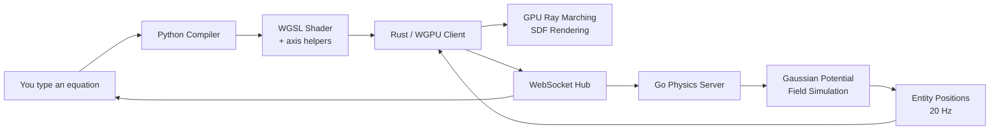

**Uclid** is a real-time 3D graphics engine where geometry, physics, and lighting are defined entirely by mathematical equations. Instead of polygons or pre-built models, everything you see is generated on the GPU via Signed Distance Fields (SDFs) and ray marching, compiled from the equations you type.

---

## Features

- **Live SDF editing** – Type an equation, see the 3D result instantly with hot-reload shader compilation.
- **GPU ray marching** – WebGPU / WGSL fragment shader renders signed distance fields at 60+ FPS.
- **Gaussian Potential Field physics** – Multi-body dynamics running at 20 Hz on the Go server, with up to 64 entities interacting via potential fields.
- **Multi-language pipeline** – Go server, Rust/WGPU client, Python compiler orchestrate a real-time editing loop.
- **Collaborative universe** – WebSocket hub keeps all connected clients in the same shared reality.
- **Blender-style axes** – Finite colored axis lines (X=red, Y=green, Z=blue) with arrow cones at the positive tips, plus tick marks and a ground grid.
- **Built-in templates** – 15 pre-built SDF shapes (sphere, box, torus, gyroid, Mandelbulb slice, etc.) to jump-start your scene.

---

## Architecture



---

## Quick Start

**Prerequisites:** Go 1.21+, Rust 1.75+, Python 3.11+

```bash
# Set up the compiler
cd compiler
python3 -m venv venv && source venv/bin/activate
pip install fastapi uvicorn pytest
cd ..

# Launch all services
./start_universe.sh
```

Once running, type an SDF equation in the editor panel and watch the world take shape.

---

## How It Works

| Layer | Technology | Role |
|-------|-----------|------|
| **Math** | WGSL fragment shader | Signed Distance Fields define all geometry |
| **Physics** | Go + Gaussian Potential Fields | Gravity, repulsion, orbital dynamics |
| **Compiler** | Python / FastAPI | Parses equations → IR → optimized WGSL |
| **Client** | Rust / WGPU | GPU rendering, egui overlay, hot-reload |
| **Network** | WebSocket | Real-time sync between services |

1. You write an SDF equation (e.g. `sqrt(x*x + y*y + z*z) - 10.0`).
2. The Python compiler parses, type-checks, optimises, and wraps it into a full WGSL module with axis helpers, lighting, and fog.
3. The Rust client hot-reloads the shader on the GPU and ray marches the scene at 60+ FPS.
4. Simultaneously, the Go server simulates particle dynamics using Gaussian Potential Fields and broadcasts entity positions.

---

## Project Structure

```
uclid/
├── client/              # Rust / WGPU rendering client
│   └── src/
│       ├── shader.wgsl  # Default ray marching shader
│       ├── renderer.rs  # WGPU pipeline setup
│       ├── app.rs       # Event loop, frame rendering
│       └── ui/          # egui overlay (editor, console, templates)
├── compiler/            # Python / FastAPI compiler
│   ├── api.py           # Compilation endpoint
│   ├── core/            # IR, type-checking, backends
│   └── templates/       # WGSL module generator
├── server/              # Go physics + WebSocket hub
│   ├── hub.go           # WebSocket broadcast
│   ├── physics.go       # Gaussian Potential Field simulation
│   └── registry.go      # Entity and field registries
├── asset/               # Images and assets
├── start_universe.sh    # Launch script
└── README.md
```

---

## Contributing

Contributions are welcome. Feel free to open issues or submit pull requests.

---

## License

MIT
